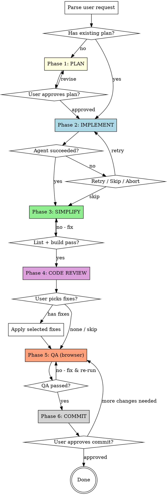

# Dev Pipeline — usrobotx

Orchestrates Plan, Implement, Simplify, Code Review, QA, and Commit as a pipeline using specialized subagents. Adapted for a single-app Next.js 16 bilingual marketing site — no backend, no K8s, no migrations.

**Three gates:** (1) User approves the Phase 1 plan, (2) User picks which code review findings to fix, (3) User approves commit after QA passes.

**No auto-commit.** Changes are only committed when the user explicitly approves after QA.

## Top-Level Flow



## Phase 1: PLAN

**Goal:** Understand current state, diff against desired state, produce a structured change plan.

This site has no dedicated `principal-architect` agent — the project is small enough that the default `Explore` + `Plan` agents cover it.

1. **Dispatch up to 3 `Explore` agents in parallel** — one per area (e.g., "home hero section", "solutions page", "motion primitives", "site-content.ts"). Use `./prompts/plan-explore.md`. Always include `fieldai-mirror/<analogous-page>.html` as a reference target.
2. **Dispatch one `Plan` agent** after Explore returns. Use `./prompts/plan-generate.md`. The plan should cover:
   - Files to modify/create with concrete paths
   - Bilingual copy keys to add/edit in `src/data/site-content.ts`
   - New CSS variables to add in `globals.css`
   - Any new dependency being proposed (motion lib, etc.) — flag explicitly
   - Verification steps (pages/locales/viewports to test)
3. **Present plan** for user approval. This is the only gate in Phase 1.

## Phase 2: IMPLEMENT

**Goal:** Execute the plan using `principal-frontend`.

1. **Dispatch `principal-frontend`** with the plan text (relevant section), file list, and the fieldai reference to benchmark against. Use `./prompts/implement-frontend.md`.
2. **Single agent, no parallel dispatch.** The app is one codebase — parallel edits on overlapping files cause merge pain for no speedup.
3. **Timeout:** 20 minutes.
4. **On failure:** Retry once with error context. If still fails, present retry/skip/abort.

## Phase 3: SIMPLIFY

**Goal:** Clean up implementation, verify type safety and lint.

1. **Dispatch `code-simplifier:code-simplifier`** on the changed files. Use `./prompts/simplify.md`.
   - Deduplicate, extract repeated strings to `site-content.ts`, move hardcoded hex to CSS variables.
2. **Run verification** (directly, not via agent):
   ```bash
   pnpm lint
   pnpm build
   ```
   `pnpm build` runs `tsc` under the hood; a clean build is the type-check gate.
3. If lint or build fails: dispatch `principal-frontend` to fix, re-verify. Max 2 fix cycles.

**Simplifier output is advisory. Lint/build failures are blocking.**

## Phase 4: CODE REVIEW ← Gate 2

**Goal:** Independent second-opinion review before QA.

**No stashing required.** The reviewer reads the current working tree.

1. **Run review in foreground** via `superpowers:code-reviewer` (or `/codex:review` if Codex is available). Prompt:

   ```
   Review ALL uncommitted changes in this repo against the following plan. Check for:
   - Alignment with the plan
   - CLAUDE.md rule violations (bilingual parity, CSS-variable discipline, scope creep, no hardcoded strings in components)
   - Accessibility: reduced-motion fallback, keyboard navigation, alt text on media
   - Performance: image sizes, unnecessary client components, motion work on main thread
   - PLAN.md alignment — does this actually move us toward the premium motion-first target, or is it stock-Next.js aesthetics?
   Report findings as a numbered list, categorized by severity: critical / warning / nit.

   Plan: <paste the Phase 1 plan here>
   ```

2. **Present findings** verbatim as a numbered list.
3. **Ask user which to address.** User can: pick numbers, "fix all", or "skip".
4. **Apply selected fixes** via `principal-frontend`. Re-run lint + build.

**Blocking gate.** No QA until user has reviewed and confirmed.

## Phase 5: QA (browser)

**Goal:** Verify in a real browser against `pnpm dev`. Motion and bilingual parity don't show up in lint/build.

**All Phase 5 agents MUST use `model: "sonnet"`** — pass this in every Agent dispatch.

1. **Start dev server** if not already running:
   ```bash
   pnpm dev &
   sleep 4
   ```
2. **Dispatch `e2e` agent** (model: sonnet) with the list of changed routes. Use `./prompts/e2e.md`. E2E covers:
   - Both locales (`/en/...` and `/zh/...`)
   - Desktop + mobile viewports
   - Scroll/motion sections
   - `prefers-reduced-motion` fallback spot-check
3. **Close browser when done.** Leave the dev server running unless you started it; if you started it, kill it.
4. If QA finds issues: fix via `principal-frontend`, re-run QA. Max 2 cycles before escalating.

**E2E runs ALONE.** Never parallel with other agents.

## Phase 6: COMMIT ← Gate 3

**Goal:** Commit only after explicit user approval.

1. **Present a summary:**
   - Files changed (grouped: components, site-content.ts, globals.css, public/media, etc.)
   - Lint + build status
   - QA results per route × locale × viewport
   - Any review findings that were skipped
   - New dependencies added (if any)
2. **Ask user for permission to commit.** Options:
   - Approve → create focused commit(s) with descriptive messages
   - Request changes → loop back to fix, re-QA
   - Abort → leave changes uncommitted
3. **If approved:** Stage and commit atomically per logical change. Do NOT push unless user explicitly asks.

**Never auto-commit. Never commit without explicit user approval.**

## Constraints

| Rule                               | Reason                                                       |
| ---------------------------------- | ------------------------------------------------------------ |
| E2E runs alone                     | Needs stable running dev server + exclusive browser          |
| Always `--headed`                  | User wants to watch                                          |
| Test both locales                  | `en`/`zh` parity is a core project invariant                 |
| Lint + build before review         | Catch type errors before asking a human reviewer             |
| 20-min agent timeout               | Prevent runaway agents                                       |
| Never auto-commit                  | User must explicitly approve commits (Phase 6)               |
| Never push without asking          | Commit ≠ push; always ask separately                         |
| Flag new dependencies in Phase 1   | Motion libraries / CMS clients are strategic choices, not implementation details |
| Three user gates                   | Plan approval, review triage, commit approval                |

## Skip Options

| Flag                           | Effect                                                 |
| ------------------------------ | ------------------------------------------------------ |
| User provides a plan file path | Skip Phase 1, read referenced plan                     |
| `--skip-simplify`              | Skip Phase 3 (for quick iteration)                     |
| `--skip-review`                | Skip Phase 4 code review                               |
| `--no-qa`                      | Skip Phase 5 (e.g., content-only change with no motion)|
| `--no-commit`                  | Skip Phase 6 (leave changes uncommitted)               |
